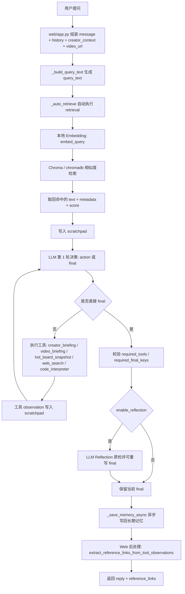

# Agent 智能体模块专项技术文档

## 1. 文档范围

本文档只覆盖本项目的 **LLM Agent 智能体模块**，重点说明：

- Agent 模块实际用了哪些技术
- 每项技术对应的精准代码位置
- 每项技术的实现方式
- 各技术之间的关联关系与整体调用链
- 每项技术的触发条件与实际调用规则

说明：

- 本项目 **没有直接使用 LangChain 的 `AgentExecutor` / `create_react_agent`**。
- 项目采用的是 **自研 `LLMWorkspaceAgent` 严格工具循环运行时**，但底层依然使用了 **LangChain/OpenAI 生态组件**，包括 `ChatOpenAI`、`langchain-chroma`、`PythonAstREPLTool` 等。

---

## 2. Agent 模块总体结构

### 2.0 如果你只懂后端、不懂 Agent，建议先这样理解

对纯后端视角来说，不要先把它理解成“神秘的 AI 智能体”，先把它理解成一个 **受控的多步工作流调度器**：

- 普通后端服务的做法通常是：
  - Controller 收请求
  - Service 写死流程
  - 依次调数据库、搜索、第三方接口
  - 最后组装返回
- 这个项目里的 Agent 模块，本质上也是同一类东西，只是把“下一步调哪个工具”的决策，从写死代码，改成了让 LLM 在受控规则下动态决定。

可以先建立这 4 个后端类比：

1. `LLMWorkspaceAgent` = 工作流编排器 / Orchestrator  
   它负责控制流程，不直接产业务数据。
2. `AgentTool` = 可调用的后端能力接口  
   类似传统后端里的 service adapter / integration client。
3. `scratchpad + tool_observations` = 运行态上下文 / 中间结果缓存  
   类似一个请求内的上下文对象。
4. `Reflection` = 结果质检 / 二次校验器  
   类似返回前的校验和重写步骤。

如果这样理解，这个项目就不难了：

- Agent 不是替代后端
- Agent 是在后端现有能力之上，加了一层“动态决策的流程控制器”
- 真正干活的仍然是：
  - 知识库检索
  - 热点抓取
  - 联网搜索
  - Python 代码执行
  - 长期记忆存储
  - Web 接口与数据整理

### 2.0.1 推荐理解顺序

如果你是只懂传统后端、不会 Agent，推荐按下面顺序理解，不要一上来就看 prompt：

1. 先看 Web 入口  
   从 `web/app.py:4268-4454` 开始，看 `api_module_create()`、`api_module_analyze()`、`api_chat()` 怎么决定是否进入 Agent 模式。

2. 再看 Agent 主运行时  
   看 `agents/llm_workspace_agent.py:315-467`，只抓一件事：它怎样在“调工具”和“返回 final”之间循环。

3. 再看工具注册表  
   看 `web/app.py:3721-3767`，先搞清楚项目到底给 Agent 暴露了哪些能力。

4. 再看每个工具的真实实现  
   顺序建议：
   - `retrieval` -> `knowledge_base.py:539-704`
   - `creator_briefing / hot_board_snapshot / video_briefing` -> `web/app.py:3594-3717`
   - `web_search` -> `tools/search_tool.py:14-49`
   - `code_interpreter` -> `tools/code_interpreter.py:15-45`

5. 再看记忆和 Reflection  
   - 长期记忆：`memory/long_term_memory.py:145-203`
   - Reflection：`agents/llm_workspace_agent.py:250-285`

6. 最后再看各链路自己的参数差异  
   - `module_create`：`web/app.py:3834-3879`
   - `module_analyze`：`web/app.py:3942-3977`
   - `chat`：`web/app.py:4020-4071`

### 2.0.2 用一句话理解整个项目

如果你要用后端人的语言总结这个项目，可以直接说：

> 这是一个 Web 后端项目，在原有规则链路之上，加了一层基于 LLM 的受控工作流编排器；LLM 不直接替代业务逻辑，而是在允许的工具集合里动态选择下一步调用哪项后端能力，最后输出结构化结果。

### 2.1 运行开关与入口

- 运行模式开关：
  - `web/app.py:468-481`
  - `runtime_llm_enabled()` / `get_active_runtime_llm_config()`
- Web 入口：
  - 内容创作：`web/app.py:4268-4292` -> `web/app.py:3834-3879`
  - 视频分析：`web/app.py:4330-4381` -> `web/app.py:3942-3977`
  - 智能对话：`web/app.py:4429-4454` -> `web/app.py:4020-4071`

### 2.2 全局基础实例

- 知识库实例：`web/app.py:255`
- 长期记忆实例：`web/app.py:256`
- 联网搜索工具实例：`web/app.py:257`
- 代码解释器实例：`web/app.py:258`
- Agent 懒加载实例：`web/app.py:3721-3767`

---

## 3. 技术清单总览

| 技术项 | 精准代码位置 | 在项目中的作用 |
| --- | --- | --- |
| 自研严格 Agent 运行时 | `agents/llm_workspace_agent.py:16-22`、`agents/llm_workspace_agent.py:36-467` | 统一管理工具注册、工具循环、最终结果校验、记忆、Reflection |
| LangChain/OpenAI LLM 接入 | `llm_client.py:119-173`、`llm_client.py:451-461` | 负责模型初始化、可用性检查、JSON 强约束调用 |
| Retrieval / RAG 工具 | `agents/llm_workspace_agent.py:22-33`、`agents/llm_workspace_agent.py:137-168`、`knowledge_base.py:539-582`、`knowledge_base.py:642-704` | 本地知识库切片入库、向量检索、自动注入 Agent scratchpad |
| Embedding / 向量库 | `knowledge_base.py:52-131`、`knowledge_base.py:178-232` | 构建 embedding、接入 Chroma、支持 fallback |
| creator_briefing 工具 | `web/app.py:3594-3605`、`web/app.py:3673-3689`、`web/app.py:3738-3742` | 为选题创作模块生成市场简报 |
| video_briefing 工具 | `web/app.py:3617-3625`、`web/app.py:3692-3703`、`web/app.py:3743-3747` | 解析视频并抓取对应市场样本，主要供聊天链路使用 |
| hot_board_snapshot 工具 | `web/app.py:2015-2066`、`web/app.py:3628-3636`、`web/app.py:3706-3717`、`web/app.py:3748-3752` | 获取热点榜/分区样本，支持趋势类判断 |
| web_search 工具 | `tools/search_tool.py:14-49`、`web/app.py:3754-3758` | 通过 SerpAPI 实时联网检索外部公开信息 |
| code_interpreter 工具 | `tools/code_interpreter.py:15-45`、`web/app.py:3759-3763` | 执行 Python 代码做数据处理/分析 |
| 长期记忆机制 | `memory/long_term_memory.py:24-203`、`agents/llm_workspace_agent.py:119-135`、`agents/llm_workspace_agent.py:287-311`、`agents/llm_workspace_agent.py:431-432` | 检索历史上下文并在任务结束后异步写回 |
| Reflection 反思自检 | `agents/llm_workspace_agent.py:250-285`、`agents/llm_workspace_agent.py:418-427` | 对最终 JSON 做二次审查与可选重写 |
| 工具结果回流到知识库 | `web/app.py:3645-3659`、`web/app.py:3673-3717` | 把工具结果沉淀回知识库，形成 RAG 数据飞轮 |
| Agent 结果后处理 | `web/app.py:3523-3550`、`web/app.py:3770-3829` | 从 `tool_observations` 中提炼参考资料并补齐前端展示结果 |

---

## 4. 各项技术的具体实现

### 4.1 自研严格 Agent 运行时

**代码位置**

- 工具抽象：`agents/llm_workspace_agent.py:16-22`
- Agent 主体：`agents/llm_workspace_agent.py:36-467`
- 主执行循环：`agents/llm_workspace_agent.py:315-467`

**实现方式**

- 通过 `AgentTool` 抽象统一工具定义，包含 `name / description / handler`。
- `LLMWorkspaceAgent` 维护：
  - `tools` 工具字典
  - `scratchpad` 工具调用记录
  - `used_tools` 已使用工具列表
  - `required_tools` 必调工具约束
  - `required_final_keys` 最终输出字段校验
- Agent 每一步都要求 LLM 返回固定 JSON：
  - `action`
  - `action_input`
  - `final`
- 允许的动作只有两类：
  - 继续调用某个工具
  - 返回 `final`

**触发条件**

- 只有 `runtime_llm_enabled()` 为 `true` 时，Web 才会进入 Agent 模式：
  - `web/app.py:468-481`
- 进入具体链路后，通过 `get_llm_workspace_agent()` 懒加载实例：
  - `web/app.py:3721-3767`

**实际调用规则**

- 如果 LLM 返回的 `action` 不在 `allowed_tools` 内，Agent 会写入 `validation_error` 并继续下一轮：
  - `agents/llm_workspace_agent.py:435-443`
- 如果 `final` 缺少要求字段，也不会直接返回，而是继续循环：
  - `agents/llm_workspace_agent.py:407-416`
- 只有在通过字段校验、必调工具校验、Reflection 后，结果才会返回：
  - `agents/llm_workspace_agent.py:396-433`

---

### 4.2 LangChain / OpenAI LLM 接入

**代码位置**

- LangChain `ChatOpenAI` 初始化：`llm_client.py:119-165`
- 可用性检查：`llm_client.py:171-173`
- 强制 JSON 调用：`llm_client.py:451-461`

**实现方式**

- `LLMClient` 统一封装模型配置：
  - provider
  - api_key
  - base_url
  - model
  - reasoning_effort
- 如果安装了 `langchain_openai`，则直接实例化 `ChatOpenAI`：
  - `llm_client.py:149-165`
- Agent 场景统一通过 `invoke_json_required()` 强制模型返回 JSON：
  - `llm_client.py:451-461`

**触发条件**

- Agent 执行前统一调用 `self.llm.require_available()`：
  - `agents/llm_workspace_agent.py:330`
- 如果模型不可用，直接抛错，不会进入工具循环：
  - `llm_client.py:171-173`

**实际调用规则**

- Agent 每一步决策都走 `invoke_json_required()`：
  - `agents/llm_workspace_agent.py:380`
- Reflection 也单独走一次 `invoke_json_required()`：
  - `agents/llm_workspace_agent.py:268-276`

---

### 4.3 Retrieval / RAG

**代码位置**

- Retrieval 工具注册：`agents/llm_workspace_agent.py:22-33`
- 自动检索注入：`agents/llm_workspace_agent.py:137-168`
- 知识入库：`knowledge_base.py:539-582`
- 知识检索：`knowledge_base.py:642-704`
- 全局知识库实例：`web/app.py:255`

**实现方式**

- `RetrievalTool` 并不自己实现检索，而是包装 `knowledge_base.retrieve()`：
  - `agents/llm_workspace_agent.py:22-33`
- 知识库入库流程：
  1. 文本切片 `_split_text()`
  2. 对切片执行 `embed_documents()`
  3. 写入 Chroma / chromadb / fallback store
  - `knowledge_base.py:539-582`
- 检索流程：
  1. 对 query 执行 `embed_query()`
  2. 走 LangChain Chroma / chromadb 查询
  3. 返回 `matches`
  - `knowledge_base.py:620-704`

**触发条件**

- 只要当前链路的 `allowed_tools` 包含 `retrieval`，Agent 会在正式工具循环之前自动先跑一遍 `_auto_retrieve()`：
  - `agents/llm_workspace_agent.py:137-168`
  - `agents/llm_workspace_agent.py:343-344`

**实际调用规则**

- `retrieval` 是 **自动触发**，不是等模型先选工具。
- 当前三个主链路都把 `retrieval` 放进了 `allowed_tools`：
  - 内容创作：`web/app.py:3860`
  - 视频分析：`web/app.py:3970`
  - 智能对话：`web/app.py:4052`
- 检索结果会被写进 `scratchpad`，供后续 LLM 继续推理：
  - `agents/llm_workspace_agent.py:165-168`
- 发给 LLM 的不是向量数组，而是 retrieval 命中的：
  - `text`
  - `metadata`
  - `score`
  这些 observation 文本化结果：
  - `knowledge_base.py:642-704`
  - `agents/llm_workspace_agent.py:57-70`

---

### 4.4 Embedding / 向量库

**代码位置**

- `DeterministicEmbeddings`：`knowledge_base.py:52-75`
- `SemanticEmbeddings`：`knowledge_base.py:78-131`
- 默认 embedding 构造：`knowledge_base.py:177-179`
- 知识库初始化：`knowledge_base.py:182-232`
- 长期记忆同样复用 embedding：`memory/long_term_memory.py:25-30`

**实现方式**

- 优先使用 `sentence-transformers` 的语义向量：
  - `knowledge_base.py:78-131`
- 如果依赖缺失或模型加载失败，则回退到确定性向量：
  - `knowledge_base.py:98-113`
- 当前仓库配置项默认指向本地 `bge-small-zh-v1.5`：
  - `.env:22`
  - `config.py:70-72`
- 在项目虚拟环境 `.venv` 可正常加载模型时，`embed_query()` / `embed_documents()` 实际工作在 **512 维**；
  如果 `sentence-transformers` 或模型不可用，才会退回 `DeterministicEmbeddings(dimension=192)`：
  - `knowledge_base.py:52-75`
  - `knowledge_base.py:78-131`
- 向量库优先使用：
  1. `langchain_chroma`
  2. `chromadb`
  3. `json_fallback`
  - `knowledge_base.py:195-238`

**触发条件**

- 知识库实例化时自动初始化 embedding 和向量库：
  - `web/app.py:255`
  - `knowledge_base.py:182-232`
- 长期记忆实例化时也会自动初始化 embedding 和 Chroma collection：
  - `web/app.py:256`
  - `memory/long_term_memory.py:24-59`

**实际调用规则**

- RAG 检索与长期记忆使用的是同一套默认 embedding 构造函数：
  - `knowledge_base.py:177-179`
  - `memory/long_term_memory.py:11`
- Embedding 发生在本地 Python 后端：
  - 知识库入库 `embed_documents()`：`knowledge_base.py:557`
  - 知识库检索 `embed_query()`：`knowledge_base.py:621`、`knowledge_base.py:663`
  - 长期记忆检索同样调用 `embed_query()`：`memory/long_term_memory.py:168-194`
- 云端 LLM 不参与向量生成，也不会直接处理向量数组。

---

### 4.5 creator_briefing 工具

**代码位置**

- Briefing 构造：`web/app.py:3594-3605`
- Tool handler：`web/app.py:3673-3689`
- Tool 注册：`web/app.py:3738-3742`
- module_create 必调约束：`web/app.py:3860-3862`

**实现方式**

- 将用户输入的 `field / direction / idea / partition` 结构化整理。
- 同时构造 `market_snapshot` 作为实时市场样本。
- 工具返回结果后，会调用 `save_tool_result_to_knowledge_base()` 写回知识库：
  - `web/app.py:3681-3688`

**触发条件**

- 仅在：
  - `module_create`
  - `chat`
  这两条链路中注册。

**实际调用规则**

- 在 `module_create` 中：
  - `creator_briefing` 既在 `allowed_tools` 中，也在 `required_tools` 中：
    - `web/app.py:3860-3862`
  - 即使模型想直接返回 `final`，如果还没调过 `creator_briefing`，也会被 Agent 拦下：
    - `agents/llm_workspace_agent.py:396-405`
- 在 `chat` 中它是可选工具，是否调用由模型决定：
  - `web/app.py:4052`

---

### 4.6 video_briefing 工具

**代码位置**

- Video briefing 构造：`web/app.py:3617-3625`
- Tool handler：`web/app.py:3692-3703`
- Tool 注册：`web/app.py:3743-3747`
- Chat 工具清单：`web/app.py:4052`

**实现方式**

- 根据视频链接完成：
  1. 提取 BVID
  2. 拉取视频公开信息
  3. 生成 `video_payload`
  4. 构造对应分区的 `market_snapshot`
- 工具执行结果同样会被写回知识库，供未来 retrieval 复用：
  - `web/app.py:3695-3702`

**触发条件**

- 当前主要在 `chat` 链路里可用：
  - `web/app.py:4052`

**实际调用规则**

- `module_analyze` 当前 **不依赖 `video_briefing`**。
- 原因是 `module_analyze` 在进入 Agent 前，后端已经先解析好了 `resolved + market_snapshot`，直接作为 `user_payload` 传入：
  - `web/app.py:3963-3968`

---

### 4.7 hot_board_snapshot 工具

**代码位置**

- 市场快照并行抓取：`web/app.py:2015-2066`
- Hot snapshot 构造：`web/app.py:3628-3636`
- Tool handler：`web/app.py:3706-3717`
- Tool 注册：`web/app.py:3748-3752`
- module_analyze 可用：`web/app.py:3970`
- chat 可用：`web/app.py:4052`

**实现方式**

- `build_market_snapshot()` 内部并行抓取三类数据：
  - `hot_board`
  - `partition_samples`
  - `peer_samples`
  - 通过 `ThreadPoolExecutor(max_workers=3)` 实现：
    - `web/app.py:2051-2057`
- `build_hot_board_snapshot()` 对外提供的是：
  - `partition`
  - `partition_label`
  - `hot_board`
  - `partition_samples`

**触发条件**

- 只有当模型主动选择 `hot_board_snapshot` 且当前链路允许该工具时才会调用。

**实际调用规则**

- `module_analyze` 可调用，但不是必调：
  - `web/app.py:3970`
- `chat` 可调用，但不是必调：
  - `web/app.py:4052`
- `module_create` 当前不注册该工具。

---

### 4.8 web_search 联网搜索

**代码位置**

- 搜索工具实现：`tools/search_tool.py:14-49`
- Tool 注册：`web/app.py:3754-3758`
- `module_create` 可用：`web/app.py:3860`
- `module_analyze` 可用：`web/app.py:3970`
- `chat` 可用：`web/app.py:4052`

**实现方式**

- 使用 `SearchTool.search()` 封装 SerpAPI 的 `GoogleSearch`。
- 输入：
  - `query`
  - `limit`
- 输出：
  - `title`
  - `link`
  - `snippet`

**触发条件**

- 当前有两种触发路径：
  1. 当前链路把 `web_search` 放进 `allowed_tools`，且模型某一步决策选择 `action="web_search"`
  2. 当前链路把 `web_search` 放进 `allowed_tools`，且前置 `retrieval` 结果为空、相关性很低或明显无关，此时 Agent 会自动补一次联网搜索

**实际调用规则**

- `web_search` 不再是“只能由模型主动选择”的工具。
- 当 `retrieval` 命中为空、top score 过高，或命中文本与查询关键片段明显对不上时，Agent 会自动执行一次 `web_search`，再把联网结果和 retrieval 结果一起交给 LLM：
  - `agents/llm_workspace_agent.py`
- 如果缺少 `SERPAPI` key 或依赖，会返回 `warning` 而不是中断整个 Agent：
  - `tools/search_tool.py:20-25`

---

### 4.9 code_interpreter 代码解释器

**代码位置**

- 工具实现：`tools/code_interpreter.py:15-45`
- Tool 注册：`web/app.py:3759-3763`
- `module_create` 可用：`web/app.py:3860`
- `module_analyze` 可用：`web/app.py:3970`
- `chat` 可用：`web/app.py:4052`

**实现方式**

- 优先使用 `langchain_experimental.tools.python.tool.PythonAstREPLTool`：
  - `tools/code_interpreter.py:18-22`
- 如果 LangChain 实验工具不可用，则退回本地 `exec`：
  - `tools/code_interpreter.py:38-45`
- 输入可以携带：
  - `code`
  - `variables`

**触发条件**

- 与 `web_search` 一样，只有模型主动选到 `code_interpreter` 才会执行。

**实际调用规则**

- 它是 **按需工具**，适合：
  - 简单计算
  - 数据清洗
  - 可视化前的中间处理
- 如果传入空代码，直接返回 `missing_code`：
  - `tools/code_interpreter.py:27-28`

---

### 4.10 长期记忆机制

**代码位置**

- 记忆存储实现：`memory/long_term_memory.py:24-203`
- 历史读取提示块：`agents/llm_workspace_agent.py:119-135`
- 异步写回：`agents/llm_workspace_agent.py:303-311`
- 最终写回触发：`agents/llm_workspace_agent.py:431-432`

**实现方式**

- 长期记忆单独维护一个 Chroma collection：
  - `user_long_term_memory`
  - `memory/long_term_memory.py:25`
- 记忆写入：
  - `save_user_data()`
  - 记录 `user_id / memory_type / created_at`
  - `memory/long_term_memory.py:145-166`
- 记忆检索：
  - `retrieve_user_history()`
  - 使用 query embedding + `user_id` filter
  - `memory/long_term_memory.py:168-203`

**触发条件**

- 历史读取由 `load_history` 决定：
  - `agents/llm_workspace_agent.py:343`
- 历史写回由 `save_memory` 决定：
  - `agents/llm_workspace_agent.py:431-432`

**实际调用规则**

- `module_create`：未显式关闭，因此沿用默认 `load_history=True / save_memory=True`
  - `agents/llm_workspace_agent.py:326-328`
  - `web/app.py:3848-3864`
- `module_analyze`：显式开启
  - `web/app.py:3972-3975`
- `chat`：未显式关闭，沿用默认开启
  - `web/app.py:4041-4054`
- 写回是异步线程，不阻塞主返回：
  - `agents/llm_workspace_agent.py:303-311`

---

### 4.11 Reflection 结果反思自检

**代码位置**

- Reflection 实现：`agents/llm_workspace_agent.py:250-285`
- Reflection 触发点：`agents/llm_workspace_agent.py:418-427`

**实现方式**

- 在拿到初版 `final` 并通过字段校验后，Agent 会额外发起一次 LLM 调用。
- Reflection 提示词会带入：
  - 任务名称
  - 任务目标
  - 用户输入
  - 响应契约
  - 工具观察
  - 当前候选结果
- LLM 返回：
  - `pass`
  - `issues`
  - `rewritten_final`

**触发条件**

- 只有 `enable_reflection=True` 时触发：
  - `agents/llm_workspace_agent.py:418`

**实际调用规则**

- `module_analyze`：显式开启
  - `web/app.py:3975`
- `module_create`：沿用默认开启
  - `agents/llm_workspace_agent.py:328`
  - `web/app.py:3848-3864`
- `chat`：沿用默认开启
  - `web/app.py:4041-4054`
- 如果 Reflection 失败，会回退为原始 `final`，不会直接报错中断：
  - `agents/llm_workspace_agent.py:268-276`

---

### 4.12 工具结果回流到知识库

**代码位置**

- 回流函数：`web/app.py:3645-3659`
- creator_briefing 写回：`web/app.py:3681-3688`
- video_briefing 写回：`web/app.py:3695-3702`
- hot_board_snapshot 写回：`web/app.py:3709-3716`

**实现方式**

- 工具执行后，把结果 JSON 序列化成文本，再作为 `Document` 写回知识库。
- metadata 中会记录：
  - `source`
  - `partition`

**触发条件**

- 当且仅当这三个工具实际被调用时触发。

**实际调用规则**

- 这是一个典型的数据飞轮：
  - 工具先产出数据
  - 数据被沉淀回知识库
  - 后续 Retrieval 可以再次召回这些结果

---

### 4.13 Agent 结果后处理

**代码位置**

- 从工具观察抽取 retrieval 命中：`web/app.py:2930`
- `module_analyze` 参考视频拼装：`web/app.py:3034-3070`
- `chat` 可点击参考链接抽取：`web/app.py:3523-3550`
- `module_analyze` 最终结果整理：`web/app.py:3770-3829`
- `chat` 引用链接拼装：`web/app.py:4066-4070`

**实现方式**

- `tool_observations` 会在 Agent 返回时自动携带：
  - `agents/llm_workspace_agent.py:428-429`
- `module_analyze` 会利用 `tool_observations` 中的 retrieval 命中补参考视频。
- `chat` 会利用 `tool_observations` 把工具返回的热视频/样本提炼成可点击 `reference_links`。

**触发条件**

- 只要工具执行过，就会出现在 `tool_observations` 里。

**实际调用规则**

- 后处理不改变 Agent 的主决策逻辑，但会增强前端展示结果。

---

## 5. 三条主链路的实际调用链

### 5.1 内容创作 module_create

**入口代码**

- HTTP 入口：`web/app.py:4268-4292`
- Agent 主流程：`web/app.py:3834-3879`

**调用链**

1. `/api/module-create` 收到用户输入
2. `runtime_llm_enabled()` 判断是否进入 Agent 模式
3. 调 `run_llm_module_create()`
4. `get_llm_workspace_agent()` 返回全局 Agent
5. `run_structured()` 先自动执行 `retrieval`
6. 模型必须至少调用一次 `creator_briefing`
7. 如有需要再调用 `web_search / code_interpreter`
8. 输出结构化结果
9. Reflection 二次审查
10. 异步写入长期记忆

**工具规则**

- `allowed_tools=["retrieval", "creator_briefing", "web_search", "code_interpreter"]`
- `required_tools=["creator_briefing"]`
- `max_steps=2`

---

### 5.2 视频分析 module_analyze

**入口代码**

- HTTP 入口：`web/app.py:4330-4381`
- Agent 主流程：`web/app.py:3942-3977`

**调用链**

1. 用户把 B 站视频链接粘进页面输入框
2. 前端先请求 `/api/resolve-bili-link`
3. 后端执行“预览快速解析链路”：
   - 先抽 `BV`
   - 优先 HTML 快速解析
   - HTML 失败才退到公开视频接口
   - 再失败才退到 `bilibili_api`
4. 解析成功后，前端拿到 `resolved`
   - `title`
   - `cover`
   - `duration`
   - `up_name`
   - `stats`
   - `partition / topic / style`
5. 用户点击视频分析，前端把：
   - `url`
   - 已解析好的 `resolved`
   一起发给 `/api/module-analyze`
6. `/api/module-analyze` 先判断前端带来的 `resolved` 是否可复用
   - 如果可复用，直接沿用，不重新完整解析
   - 如果不可复用，再走完整解析链路 `resolve_video_payload()`
7. 后端执行 `build_hot_peer_market_snapshot(resolved)`
   - 纯代码预抓“同方向爆款” `peer_samples`
   - 这一步直接走 B 站公开 HTTP 接口，不走 Chroma
8. 进入 `run_llm_module_analyze()`
9. `run_structured()` 在严格约束下先调用 `retrieval`
10. `retrieval` 走本地知识库检索
    - `KNOWLEDGE_BASE.retrieve(...)`
    - 过滤条件是 `static_hot_case + knowledge_base`
11. 如果 retrieval 样本明显不足，模型才允许继续调 `web_search`
12. 工具调用完成后，模型直接输出 `final`
13. `finalize_module_analyze_result()` 做统一后处理：
    - 统一 `performance / optimize_result / analysis`
    - 合并 `peer_samples + retrieval` 为 `reference_videos`
    - 如果真实 `reference_videos` 为空，就回退使用 LLM 已给出的 `benchmark_videos` 作为轻量参考卡片
14. 前端渲染：
    - 当前视频基础信息
    - 表现判断
    - 下一批题材建议
    - 标题 / 封面 / 内容优化建议
    - 可直接使用的新文案
    - “建议直接对标的参考视频”

**工具规则**

- `allowed_tools=["retrieval", "web_search"]`
- `required_tools=["retrieval"]`
- `strict_required_tool_order=True`
- `load_history=False`
- `save_memory=False`
- `enable_reflection=False`

**补充说明**

- `/api/resolve-bili-link` 是“快速预览链路”，目标是尽快拿到基础视频信息
- `/api/module-analyze` 是“完整分析链路”，重点是：
  - 使用已解析视频信息
  - 预抓同方向爆款样本
  - 检索本地静态热门案例
  - 由 LLM 生成完整分析结果
- 当前“同类爆款视频”不是单一路径，而是三层来源：
  1. `peer_samples`
  2. retrieval 命中的静态热门案例
  3. LLM 原始 benchmark 兜底

---

### 5.3 智能对话 chat

**入口代码**

- HTTP 入口：`web/app.py:4429-4454`
- Agent 主流程：`web/app.py:4020-4071`

**调用链**

1. `/api/chat` 收到自然语言消息
2. 组装 `creator_context + history + video_url`
3. `run_structured()` 自动先跑 `retrieval`
4. 模型按意图决定是否再调：
   - `creator_briefing`
   - `video_briefing`
   - `hot_board_snapshot`
   - `web_search`
   - `code_interpreter`
5. 返回自然语言回复 JSON
6. Reflection 二次审查
7. 异步写入长期记忆
8. 基于 `tool_observations` 抽取 `reference_links`

**工具规则**

- `allowed_tools=["retrieval", "creator_briefing", "video_briefing", "hot_board_snapshot", "web_search", "code_interpreter"]`
- 无 `required_tools`

---

### 5.4 用户提问场景下的真实 Agent + RAG 时序

这一节专门回答“用户提问后，当前项目到底是不是只在最后调一次 LLM”。

**先说结论**

- 不是只在最后调用一次 LLM。
- 但也不是固定写死成“先判断知识够不够，再判断要不要联网，再判断搜索结果够不够，最后总结”这 4 次。
- 当前真实实现是：
  1. 先自动执行一次 retrieval
  2. 然后进入 `run_structured()` 的有限步工具循环
  3. 每一轮都由 LLM 决定：继续调工具，还是直接返回 `final`
  4. 如果开启 `enable_reflection=True`，最终结果前还会再多一次 Reflection LLM 调用

**对应代码位置**

- 自动 retrieval：`agents/llm_workspace_agent.py:137-168`、`agents/llm_workspace_agent.py:343-344`
- 每轮决策调用 LLM：`agents/llm_workspace_agent.py:346-380`
- 工具执行后回到下一轮：`agents/llm_workspace_agent.py:444-465`
- `final` 校验：`agents/llm_workspace_agent.py:388-417`
- Reflection：`agents/llm_workspace_agent.py:250-285`、`agents/llm_workspace_agent.py:418-427`

**需要修正的几个常见理解**

1. “先用 LLM 判断要不要查知识库”不准确。  
   当前 chat / module_create / module_analyze 只要 `allowed_tools` 里有 `retrieval`，都会先自动检索，再把命中结果交给 LLM：
   - `agents/llm_workspace_agent.py:145-168`
   - `agents/llm_workspace_agent.py:343-344`

2. “Web Search 是固定第二步”不准确。  
   `web_search` 不是固定第二步，但现在也不再完全依赖模型手动选择。
   当前实现是：
   - 如果前置 retrieval 明显无效，Agent 会先自动补一次 `web_search`
   - 如果 retrieval 足够，后续是否继续联网，仍由某一轮 LLM 决策决定

3. “搜索结果充分性有单独一层专门校验器”不准确。  
   搜索结果回来后，并不是进入一个写死的 `search_validator`；而是下一轮 LLM 看到新的 `scratchpad` 后，再决定继续调工具还是直接输出 `final`：
   - `agents/llm_workspace_agent.py:57-70`
   - `agents/llm_workspace_agent.py:346-380`
   - `agents/llm_workspace_agent.py:444-465`

4. “Embedding 在云端 LLM 里完成”不准确。  
   Embedding 完全发生在本地后端的知识库 / 长期记忆层，LLM 只消费 retrieval 返回的文本化 observation：
   - `knowledge_base.py:557`
   - `knowledge_base.py:621`
   - `knowledge_base.py:663`
   - `memory/long_term_memory.py:168-194`

5. “向量匹配后直接把向量发给 LLM”不准确。  
   传给 LLM 的是命中的原文片段、metadata、score；向量只用于检索排序：
   - `knowledge_base.py:642-704`
   - `agents/llm_workspace_agent.py:57-70`

**Mermaid 时序图**



**怎么理解这个流程最贴近当前代码**

- Agent 运行时本身不负责“知识够不够、要不要联网”的业务判断。
- Agent 运行时只负责：
  - 自动 retrieval
  - 把可用工具和历史 observation 交给 LLM
  - 执行 LLM 选中的工具
  - 校验 `final`
  - 触发 Reflection 和异步记忆写回
- 真正做“当前信息是否足够、下一步要不要继续查”的，是每一轮的 LLM 决策。

---

## 6. 关联关系图

```text
Web API
  -> run_llm_module_create / run_llm_module_analyze / run_llm_chat
    -> get_llm_workspace_agent()
      -> LLMWorkspaceAgent.run_structured()
        -> _history_block()        -> LongTermMemory.retrieve_user_history()
        -> _auto_retrieve()        -> RetrievalTool -> KnowledgeBase.retrieve()
        -> LLM 决策 action/final   -> LLMClient.invoke_json_required()
        -> 可选工具调用
           -> creator_briefing     -> build_creator_briefing() -> build_market_snapshot()
           -> video_briefing       -> build_video_briefing()   -> fetch_video_info() + build_market_snapshot()
           -> hot_board_snapshot   -> build_hot_board_snapshot() -> build_market_snapshot()
           -> web_search           -> SearchTool.search()
           -> code_interpreter     -> CodeInterpreterTool.run()
        -> final 校验
        -> Reflection              -> _reflect_final()
        -> save_memory_async()     -> LongTermMemory.save_user_data()
        -> 返回 agent_trace + tool_observations
    -> Web 后处理
      -> module_analyze: finalize_module_analyze_result()
      -> chat: extract_reference_links_from_tool_observations()
```

---

## 7. 触发条件与实际调用规则矩阵

| 技术 / 工具 | module_create | module_analyze | chat | 是否自动触发 | 备注 |
| --- | --- | --- | --- | --- | --- |
| Agent 运行时 | 是 | 是 | 是 | 否 | 前提是 `runtime_llm_enabled()` 为真 |
| retrieval / RAG | 是 | 是 | 是 | **是** | 只要在 `allowed_tools` 中就会 `_auto_retrieve()` |
| creator_briefing | 是 | 否 | 是 | 否 | 在 `module_create` 中是必调 |
| video_briefing | 否 | 否 | 是 | 否 | 分析链路已提前拿到 `resolved + market_snapshot` |
| hot_board_snapshot | 否 | 是 | 是 | 否 | 仅模型判断需要热点榜时调用 |
| web_search | 是 | 是 | 是 | 条件自动 / 按需 | retrieval 无效时自动补搜；否则由模型决定是否联网 |
| code_interpreter | 是 | 是 | 是 | 否 | 仅模型判断需要计算/代码执行时调用 |
| 记忆读取 | 是 | 是 | 是 | 否 | 取决于 `load_history`，当前三条主链路均开启 |
| 记忆写回 | 是 | 是 | 是 | 否 | 取决于 `save_memory`，当前三条主链路均开启 |
| Reflection | 是 | 是 | 是 | 否 | 取决于 `enable_reflection`，当前三条主链路均开启 |

---

## 8. 关键规则总结

### 8.1 哪些能力是“自动触发”的

- `retrieval` 是稳定自动触发能力：
  - `agents/llm_workspace_agent.py:343-344`
- `web_search` 在特定条件下也会自动触发：
  - 当前链路允许 `web_search`
  - 且前置 retrieval 为空、低相关或明显无关
  - 这时 Agent 会先补一次联网搜索，再让 LLM 决策后续输出

### 8.2 哪些能力是“模型按需选择”的

- `creator_briefing`
- `video_briefing`
- `hot_board_snapshot`
- `code_interpreter`

它们都必须由模型在某一步返回对应 `action` 才会执行：

- `agents/llm_workspace_agent.py:445-464`

`web_search` 例外：

- 如果 retrieval 已被判定为无效，Agent 可能先自动补一次 `web_search`
- 在那之后，模型仍然可以继续决定是否再次联网或改调其他工具

### 8.3 哪些规则会强制约束模型

- 非法工具不允许执行：
  - `agents/llm_workspace_agent.py:435-443`
- 缺少必调工具不允许直接返回：
  - `agents/llm_workspace_agent.py:396-405`
- 缺少最终字段不允许直接返回：
  - `agents/llm_workspace_agent.py:407-416`

### 8.4 哪些结果会被沉淀复用

- `creator_briefing`
- `video_briefing`
- `hot_board_snapshot`

这三类工具输出会回写知识库，后续又可以被 Retrieval 召回：

- `web/app.py:3645-3659`
- `web/app.py:3673-3717`

---

## 9. 结论

本项目的 Agent 模块本质上是一个 **自研严格控制型工具 Agent**，核心特点是：

- 运行时自研，底层依赖 LangChain / OpenAI 生态
- RAG 检索是默认前置步骤，不依赖模型先决定
- 联网搜索、热点快照、代码解释器都是按需工具
- 长期记忆、Reflection、工具回流知识库共同形成增强闭环
- 三条 Web 主链路共用同一套 Agent 中枢，但各自的 `allowed_tools / required_tools / max_steps` 不同

如果后续继续扩展 Agent 模块，最应该优先关注的代码入口是：

- `agents/llm_workspace_agent.py:315-467`
- `web/app.py:3721-3767`
- `web/app.py:3834-4071`
- `knowledge_base.py:539-704`
- `memory/long_term_memory.py:145-203`
